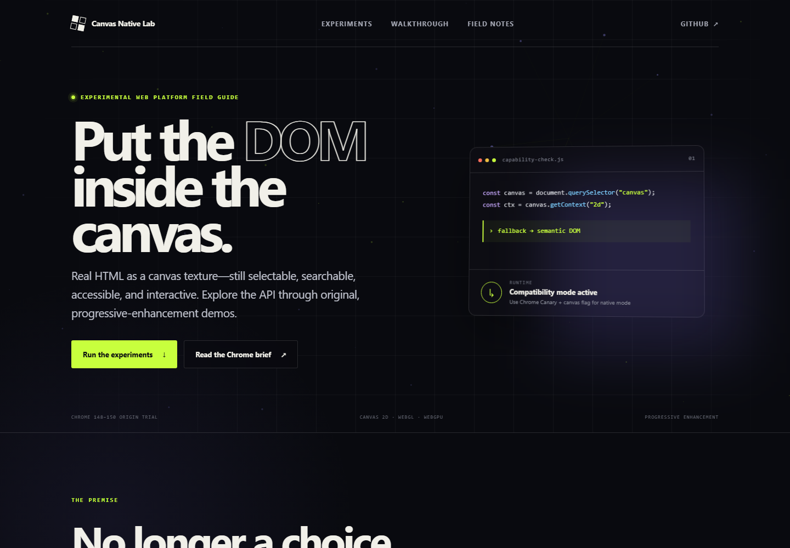

# Canvas Native Lab

An original, interactive field guide to the experimental
[HTML-in-Canvas API](https://developer.chrome.com/blog/html-in-canvas-origin-trial).



The lab makes the API’s central idea tangible: render semantic DOM into Canvas
2D, WebGL, or WebGPU without giving up browser-native behavior. The experience
is deliberately progressive—every demo remains useful when the experimental API
is unavailable.

## What is inside

- **Interactive control surface** — a real form prepared for
  `drawElementImage()`, with a semantic DOM fallback.
- **Pixel lens** — a Canvas 2D optics study that works in current browsers.
- **Spatial stack** — an interactive DOMMatrix-inspired transform model.
- **Capability Atlas** — 16 runnable labs covering every documented rendering
  primitive, layout behavior, and preserved browser integration.
- **API anatomy** — a three-step, copyable implementation walkthrough.
- **Field notes** — browser support, tradeoffs, accessibility, and production
  guidance.

## Run locally

The project has no runtime dependencies and no build step.

```bash
npm start
```

Then open [http://localhost:4173](http://localhost:4173).

`npm start` uses Python’s standard-library HTTP server. You can substitute any
static server if Python is not available.

## Try the native experiment

As documented by Chrome for Developers, the early API is available in the Chrome
148–150 origin trial. For local experimentation:

1. Install Chrome Canary 149 or newer.
2. Open `chrome://flags/#canvas-draw-element`.
3. Enable the flag and restart the browser.
4. Run this site from a local server.
5. Open Experiment 01 and select **Native API**.

Implementation details are in [`docs/getting-started.md`](./docs/getting-started.md).

## Project principles

1. **The DOM is the source of truth.** Canvas is a rendering destination, not a
   replacement for semantics.
2. **Feature-detect, never browser-sniff.** The lab checks for
   `CanvasRenderingContext2D.prototype.drawElementImage`.
3. **Fallback is part of the design.** Unsupported browsers see a first-class
   DOM experience.
4. **Respect user preferences.** Animation pauses for `prefers-reduced-motion`.
5. **Treat the API as experimental.** Names and behavior may change during the
   origin trial.

## Documentation

- [Getting started](./docs/getting-started.md)
- [How the API works](./docs/how-it-works.md)
- [Browser support strategy](./docs/browser-support.md)
- [Feature coverage matrix](./docs/feature-coverage.md)

## Sources and inspiration

- [Chrome for Developers: Introducing the HTML-in-Canvas API origin trial](https://developer.chrome.com/blog/html-in-canvas-origin-trial)
- [WICG HTML-in-Canvas explainer](https://github.com/WICG/html-in-canvas)
- [Canvas UI](https://canvasui.dev/) — the community library discussed in
  OrcDev’s video
- [OrcDev: “The Biggest Web UI Breakthrough in Years”](https://www.youtube.com/watch?v=aVgR5YHk4QA)

This repository contains original demos and presentation. It is not affiliated
with Canvas UI, OrcDev, Google, or the Chromium project.

## License

[MIT](./LICENSE)
